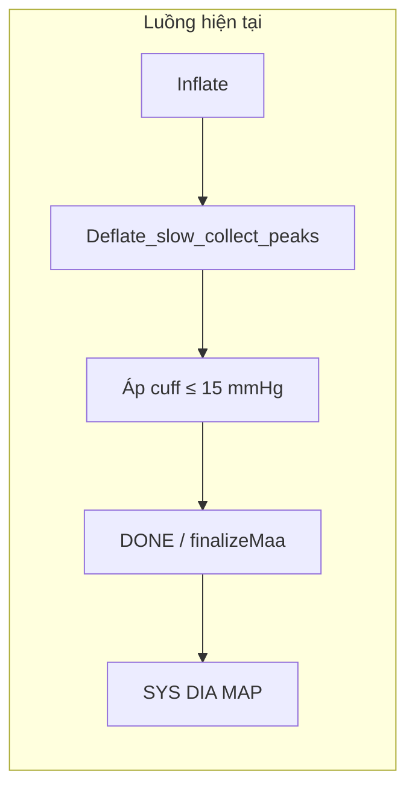

Dựa vào tài liệu nghiên cứu chuyên sâu về **Thuật toán Biên độ Tối đa (MAA - Maximum Amplitude Algorithm)** mà bạn cung cấp, tôi sẽ giải thích lại thuật toán tính huyết áp một cách rõ ràng, từng bước (step-by-step), giúp bạn dễ dàng hình dung để chuyển hóa thành code C trên STM32.

Cốt lõi của máy đo huyết áp điện tử hiện nay không phải là "nghe" tiếng mạch đập (như bác sĩ dùng tai nghe), mà là đo sự **thay đổi thể tích vi mô của động mạch** thông qua các dao động áp suất truyền ra vòng bít.

Dưới đây là cơ chế hoạt động chi tiết của thuật toán MAA:

---

### BƯỚC 1: Thu thập và Tách tín hiệu (Hình thành OWE)

Trong quá trình xả khí từ từ (2-3 mmHg/giây), cảm biến áp suất sẽ thu được một tín hiệu tổng hợp. Thuật toán của bạn (đã bàn ở phần firmware) cần tách tín hiệu này làm 2 thành phần:

1.  **Tín hiệu DC (Áp suất bao cuốn - $P_c$):** Là đường áp suất đang giảm dần từ 160 mmHg xuống 0 mmHg.

2.  **Tín hiệu AC (Xung dao động mạch đập):** Ban đầu khi áp suất bao cuốn rất cao, mạch máu bị ép chặt $\rightarrow$ dao động rất nhỏ. Khi áp suất xả dần, máu bắt đầu đi qua được $\rightarrow$ dao động lớn dần.

3.  **Hình thành đường bao (OWE - Oscillometric Waveform Envelope):** Bạn nối các đỉnh của tín hiệu AC lại với nhau, bạn sẽ được một biểu đồ hình "quả chuông". Thuật toán sẽ làm việc trên cái hình quả chuông này.

### BƯỚC 2: Xác định điểm mốc - Huyết áp trung bình (MAP)

Tài liệu chỉ ra một sự thật vật lý rất quan trọng: **MAP là thông số duy nhất được xác định trực tiếp từ thực nghiệm.**

*   **Cơ chế:** Khi áp suất bao cuốn xả xuống vừa đúng bằng áp suất bên trong động mạch, thành mạch máu ở trạng thái "lỏng lẻo nhất" (độ đàn hồi cực đại). Lúc này, nhịp đập của tim truyền ra vòng bít tạo ra dao động mạnh nhất.

*   **Thuật toán:** Quét mảng dữ liệu đỉnh AC, tìm giá trị có biên độ lớn nhất, gọi là $A_{max}$.

*   **Kết quả 1:** Áp suất DC (áp suất bao cuốn) tương ứng tại thời điểm xảy ra $A_{max}$ chính là **Huyết áp trung bình (MAP)**.

### BƯỚC 3: Tính Tâm thu (SBP) và Tâm trương (DBP) bằng Hệ số

Vì không có điểm cực đại hay cực tiểu nào rõ ràng cho SBP và DBP trên hình quả chuông, MAA bắt buộc phải dùng **Toán học Nội suy** dựa trên các "Hệ số thực nghiệm" (Characteristic Ratios).

Tài liệu định nghĩa 2 hệ số cốt lõi:

*   **$r_s$ (Hệ số tâm thu):** Thường dao động từ `0.45 - 0.57` (tiêu chuẩn Geddes hay dùng là **0.5** hoặc **0.55**).

*   **$r_d$ (Hệ số tâm trương):** Thường dao động từ `0.69 - 0.89` (chuẩn hay dùng là **0.7** hoặc **0.85**).

**Cách thuật toán tìm Huyết áp Tâm Thu (SBP):**

1. Tính mức biên độ mục tiêu: $A_{sys} = r_s \times A_{max}$ (Ví dụ: $0.5 \times A_{max}$).

2. Dò ngược mảng dữ liệu từ điểm MAP về **phía áp suất cao** (nhánh đi lên của quả chuông).

3. Tìm xung AC nào có biên độ xấp xỉ bằng $A_{sys}$.

4. Chiếu xung AC đó xuống xem áp suất DC lúc đó là bao nhiêu $\rightarrow$ **Đó chính là Huyết áp Tâm Thu (SBP).**

**Cách thuật toán tìm Huyết áp Tâm Trương (DBP):**

1. Tính mức biên độ mục tiêu: $A_{dia} = r_d \times A_{max}$ (Ví dụ: $0.7 \times A_{max}$).

2. Dò xuôi mảng dữ liệu từ điểm MAP về **phía áp suất thấp** (nhánh đi xuống của quả chuông).

3. Tìm xung AC nào có biên độ xấp xỉ bằng $A_{dia}$.

4. Chiếu xung AC đó xuống xem áp suất DC lúc đó là bao nhiêu $\rightarrow$ **Đó chính là Huyết áp Tâm Trương (DBP).**

---

### VÍ DỤ MINH HỌA BẰNG SỐ LIỆU ĐỂ CODE:

Giả sử bạn đo được mảng dữ liệu như sau (Rút gọn):

*   Áp suất vòng bít (DC): `[150, 140, 130, 120, 110, 100, 90, 80, 70, 60]` mmHg

*   Biên độ nhịp đập (AC): `[ 1 ,  2 ,  3 ,  5 ,  8 ,  10,  7 , 6 ,  4 ,  2 ]` mmHg

**Bước 1:** Cài đặt hệ số $r_s = 0.5$ và $r_d = 0.7$.

**Bước 2:** Thuật toán tìm Max trong mảng AC $\rightarrow$ $A_{max} = 10$.

$\rightarrow$ Áp suất vòng bít lúc đó là **100 mmHg $\rightarrow$ MAP = 100**.

**Bước 3 (Tìm SBP):** Mức biên độ $A_{sys} = 0.5 \times 10 = 5$. Dò về phía áp suất > 100, ta thấy tại AC = 5, áp suất vòng bít là **120 mmHg $\rightarrow$ Tâm Thu (SBP) = 120**.

**Bước 4 (Tìm DBP):** Mức biên độ $A_{dia} = 0.7 \times 10 = 7$. Dò về phía áp suất < 100, ta thấy tại AC = 7, áp suất vòng bít là **90 mmHg $\rightarrow$ Tâm Trương (DBP) = 90**.

Kết quả hiển thị ra màn hình: **120 / 90 mmHg.**

---

### BƯỚC 4: Các nâng cấp chuyên sâu để code "Xịn" hơn (Theo tài liệu)

Nếu bạn chỉ code theo 3 bước trên, máy của bạn đo người bình thường sẽ đúng, nhưng đo người già (mạch máu xơ cứng) sẽ bị sai. Tài liệu chỉ ra các cách giải quyết mà bạn có thể áp dụng vào STM32:

1.  **Lọc nhiễu trước khi tính toán:** Ở điều kiện thực tế, khi xả khí, tay người dùng có thể rung (artifact). Tài liệu khuyên dùng **lọc số (Digital Filtering) Band-pass từ 0.5 - 5 Hz** để giữ lại đúng nhịp tim người, và loại bỏ Outlier (các xung AC tự nhiên cao/thấp đột biến).

2.  **Khớp đường cong (Curve Fitting - Gaussian):** Mảng dữ liệu của bạn có thể không có điểm nào chính xác bằng `0.5 * A_max` (ví dụ đo thực tế AC nhảy từ 4.5 lên thẳng 5.8). Thay vì lấy gần đúng, các hãng lớn (như GE, Philips) dùng toán học để vẽ một hàm Gaussian mô phỏng lại đường bao AC để nội suy ra con số áp suất mượt mà nhất.

3.  **Hệ số thích ứng (Biến thiên):** Thay vì fix cứng mã lệnh C là `rs = 0.5`, thuật toán hiện đại sẽ phân tích "độ rộng của hình quả chuông". Quả chuông càng rộng chứng tỏ mạch máu bệnh nhân càng cứng (người già), STM32 sẽ tự động thay đổi hệ số $r_s$ lên 0.54, $r_d$ lên 0.72 để kết quả không bị sai lệch.

---

## Thời điểm có SYS/DIA trong repo và khả năng xả nhanh sớm

Phần này mô tả **hành vi thực tế** của firmware + WebApp (MAA trong `webapp/src/dsp.ts`), không thay thế các bước lý thuyết ở trên.

### Khi nào mới có SYS và DIA?

1. **Về thuật toán MAA:** Cần đủ điểm trên **đường bao** (biên độ AC theo áp vòng bít giảm dần): xác định **MAP** tại biên độ cực đại \(A_{max}\), rồi suy **SBP** trên nhánh áp cuff **cao hơn** MAP và **DBP** trên nhánh **thấp hơn** MAP (hệ số \(r_s\), \(r_d\)). Không thể bỏ qua nhánh dưới MAP nếu muốn DBP đáng tin.

2. **Trong code WebApp:** Các đỉnh bao được gom trong pha xả chậm (`deflate`). Hàm `finalizeMaa()` / `runMaa()` chỉ chạy khi FSM MCU báo **kết thúc đo** (chuyển trạng thái tương ứng `meas_end`). `runMaa` còn yêu cầu **ít nhất 5 đỉnh**; nếu ít hơn thì không trả về kết quả.

3. **Trên firmware (ví dụ `stm32-arduino-pio`):** Pha `DEFLATE_MEASURE` xả chậm cho đến khi áp vòng bít xuống **≤ `MEASURE_END_PRESSURE_MMHG`** (khoảng 15 mmHg, có debounce), rồi `DONE`. Điều này **không** phụ thuộc vào việc WebApp đã “tính xong” hay chưa; thời lượng xả chậm cố định theo ngưỡng áp cuối.

### Có thể xác định sớm rồi xả nhanh không?

**Có thể về nguyên tắc**, nhưng không phải “vừa thấy tín hiệu ổn là dừng”:

- Cần đủ mẫu **phía dưới MAP** (thường áp cuff đã xuống **thấp hơn DBP ước lượng thêm một biên an toàn**), vì nhánh đó phẳng và nhiễu — dừng sớm quanh MAP hoặc ngay sau SBP làm **DBP sai hoặc không tính được**.
- Mở van xả **đột ngột** khi áp còn cao có thể làm méo dao động tùy cơ khí/điều khiển; cần thử nghiệm riêng.

Hướng triển khai sau này (chưa có trong firmware hiện tại): chạy MAA thử trên bộ đỉnh đang tăng, kiểm tra ổn định ước lượng và áp cuff đã đủ thấp, rồi mới gửi lệnh kết thúc đo / xả nhanh (cần mở rộng giao thức UART và kiểm tra an toàn).

### Lưu ý: code thuật toán khác trong repo

Module `Algorithm/test001` (ví dụ `peak_detection.c`) dùng mô hình kiểu “baseline + max/min biên độ đỉnh” — **không tương đương** MAA + \(r_s\)/\(r_d\) như WebApp và mục lý thuyết ở trên.